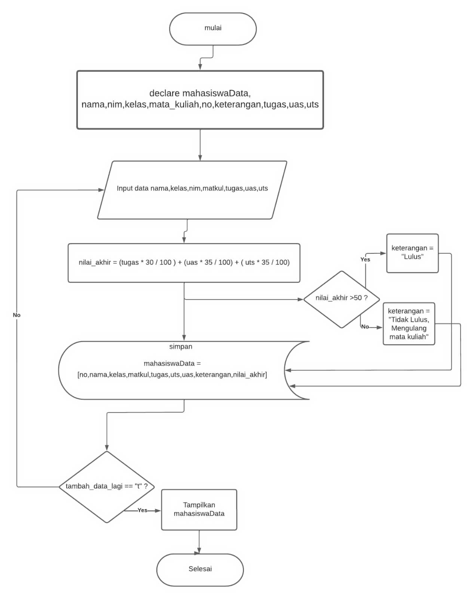

| Nama  | M Muammar |
|  ---  |   ---     |
| NIM   | 312210663 |
| kelas | TI.22.B1  |

## **Latihan Membuat list, Menambahka, Mengedit, Mengambil elment pada list Python.**
---
## *Repository ini sebagai tugas Mata Kuliah Bahasa Pemrograman*
1. Pertama buatlah sebuah folder Praktikum5 dan didalamnya diisi file list.py & Praktikum5.py sebagai berikut:

    

2. Selanjutnya buka file list.py lalu masuka kode dibawah ini:

    
    

3. Selanjutnya jalankan file dan akan menghasilkan output seperti dibawah ini:

    

## __Membuat program input data mahasiswa beserta nilai dan disimpan didalam list.__
---
Berikut Flowchat program yang akan kita buat:

## Requirement
  - [install pip](https://pypi.org/project/pip/)
  - [cara instal pip](https://www.anbidev.com/python-pip/)
  - Package Tabulate 
  1. Pertama kita install package Tabulate dengan cara dengan cara buka terminal lalu copas pip install tabulate sebagai berikut:

  2. Lalu buka file Praktikum5.py dan masukan kode berikut:

  3. Selanjutnya jlankan file dan akan menghasilkan output seperti dibawah ini

## *otsukaresamadeshita*